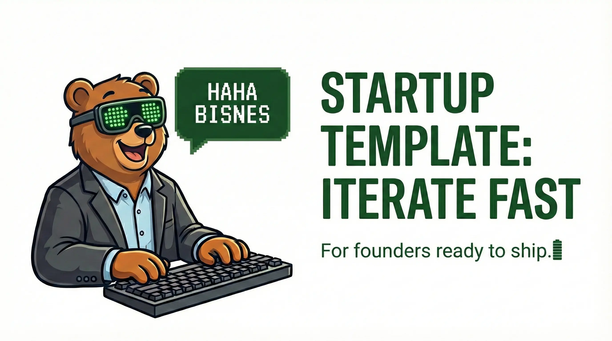

<p align="center">
  
</p>

# bisnes

Startup template for founders ready to ship. Clone, install, iterate fast.

```sh
git clone https://github.com/onnimonni/bisnes && cd bisnes
devenv shell
claude --yolo
```

## Why bisnes?

Most startup templates give you a stack. bisnes gives you a **development environment** — one where AI agents and humans work from the same config, the same tools, and the same permissions.

Everything is declared in one file: `devenv.nix`. Languages, services, git hooks, MCP servers, AI agent permissions. One file to rule them all.

## What's included

| Component | What it does |
|---|---|
| **Elixir + Phoenix** | Production backend on BEAM |
| **Bun + Node.js** | Fast runtime, tooling, scripts |
| **AI Coding Agent** | Claude with configured permissions |
| **AI Browser Agent** | Playwright browser automation |
| **AI UX Agent** | Gemini for automated UX reviews |
| **Git Hooks** | Lint, test, secret scanning |

## Why devenv.nix?

**Hard for humans.** Nix syntax is alien. The learning curve is steep.

**Great for AI.** That's the point. AI agents can read, modify, and extend `devenv.nix` reliably because:

- **Declarative** — describes *what* the environment should be, not *how* to set it up
- **Single source of truth** — no scattered Dockerfiles, Makefiles, shell scripts, and CI yamls
- **Reproducible** — every developer and every AI agent gets the exact same environment
- **Composable** — `languages.elixir.enable = true;` and you're done

Humans set this up once (or let AI do it). Then everyone benefits from a reproducible environment forever.

## Getting started

1. Install [devenv.sh](https://devenv.sh/getting-started/) and nix
2. Install [homebrew](https://brew.sh/)
3. `devenv shell` — everything installs
4. Start building
